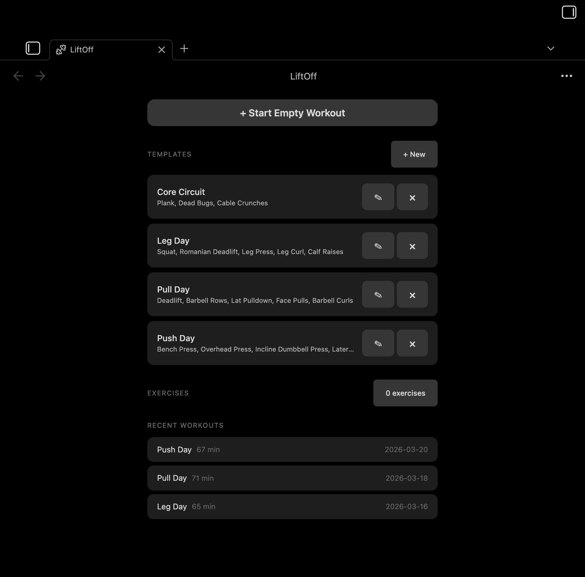
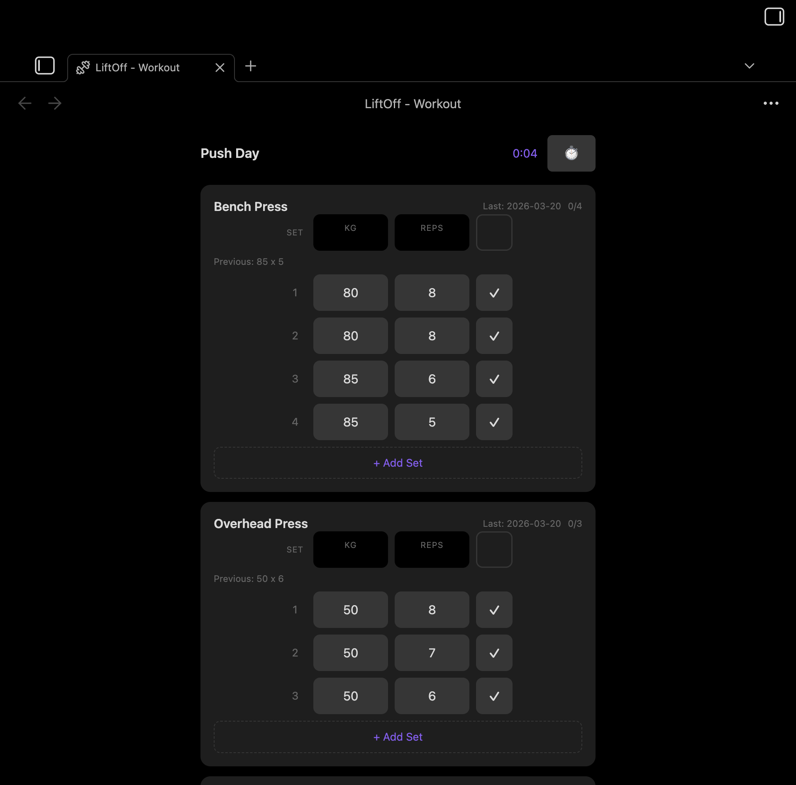
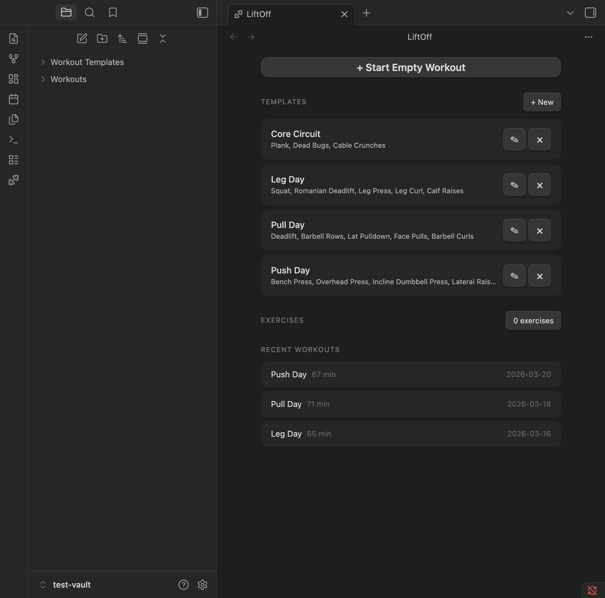
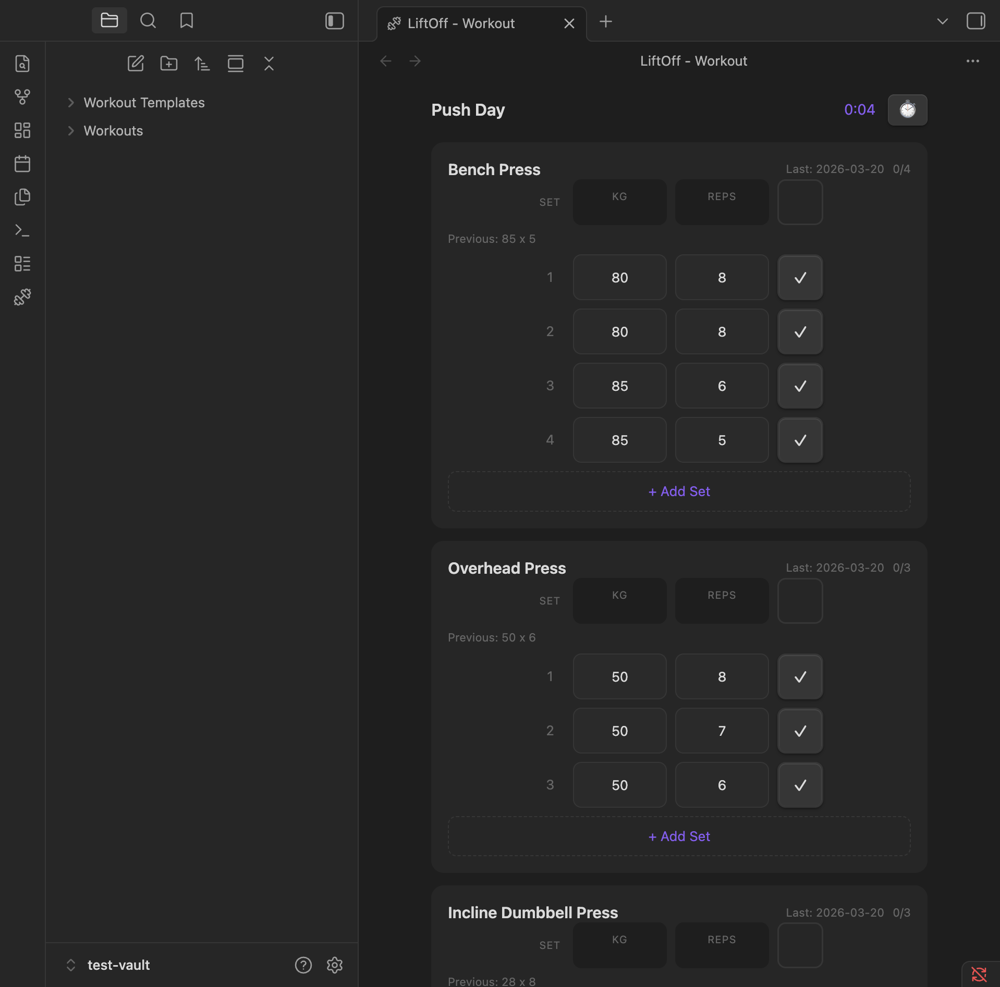
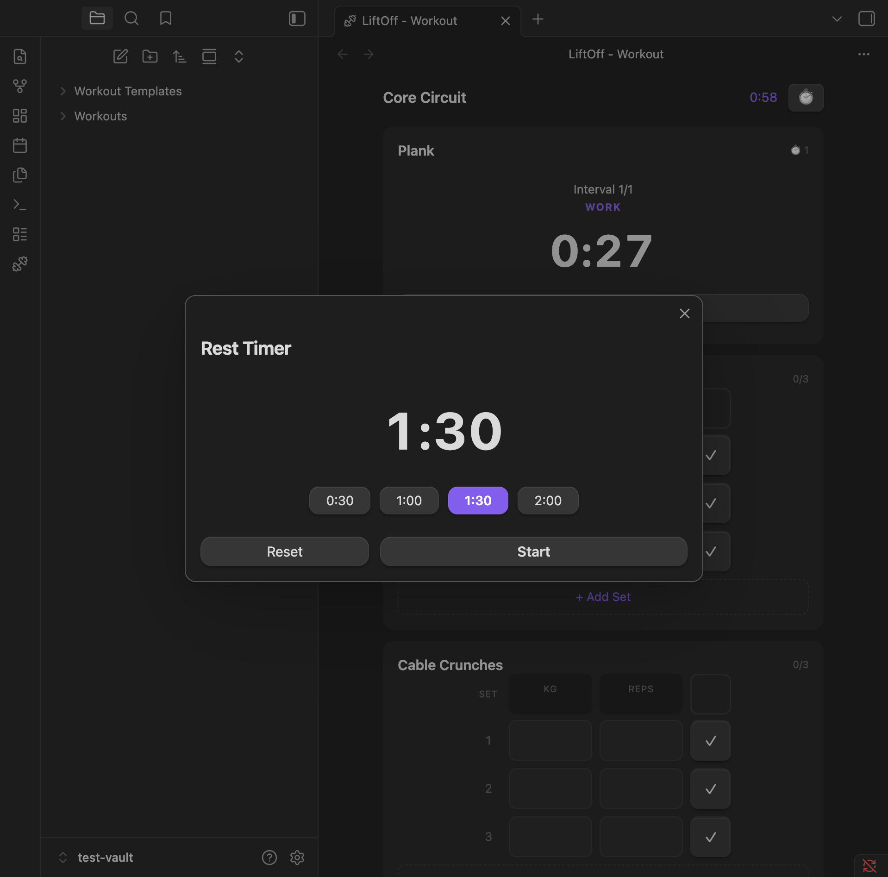
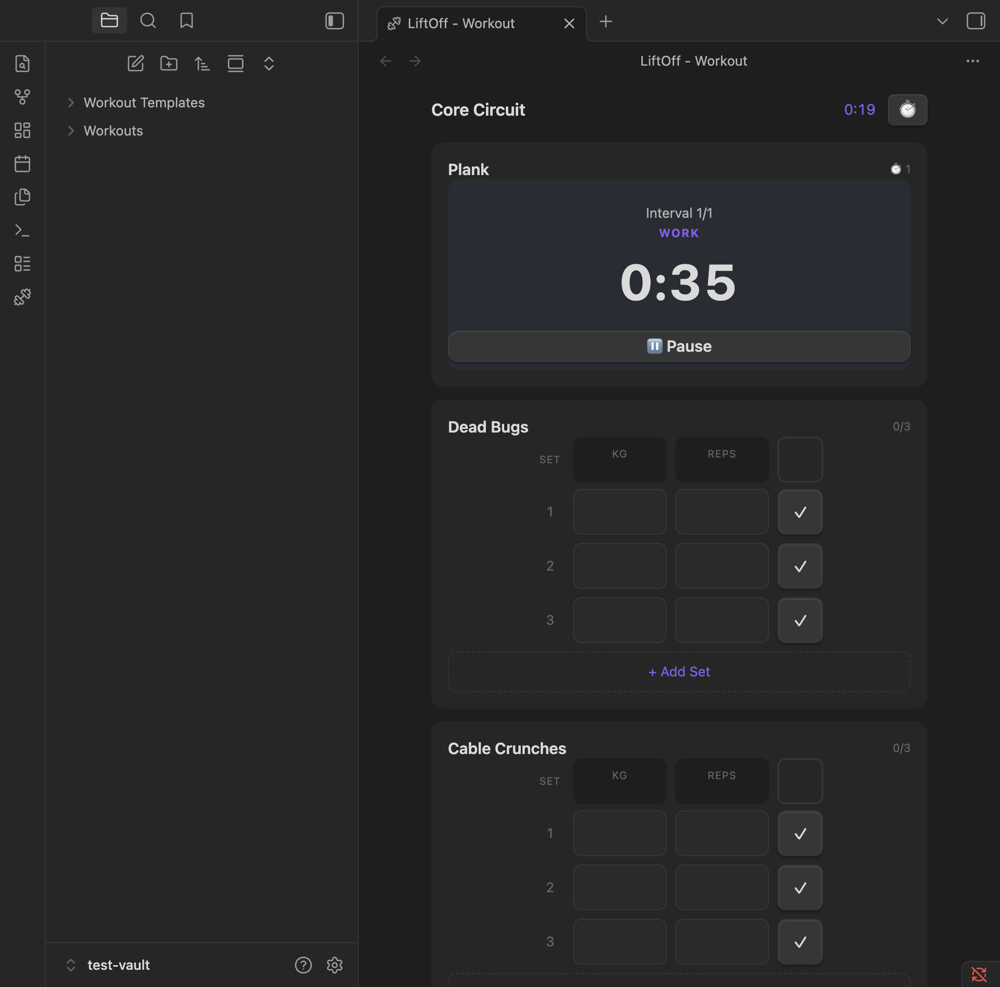
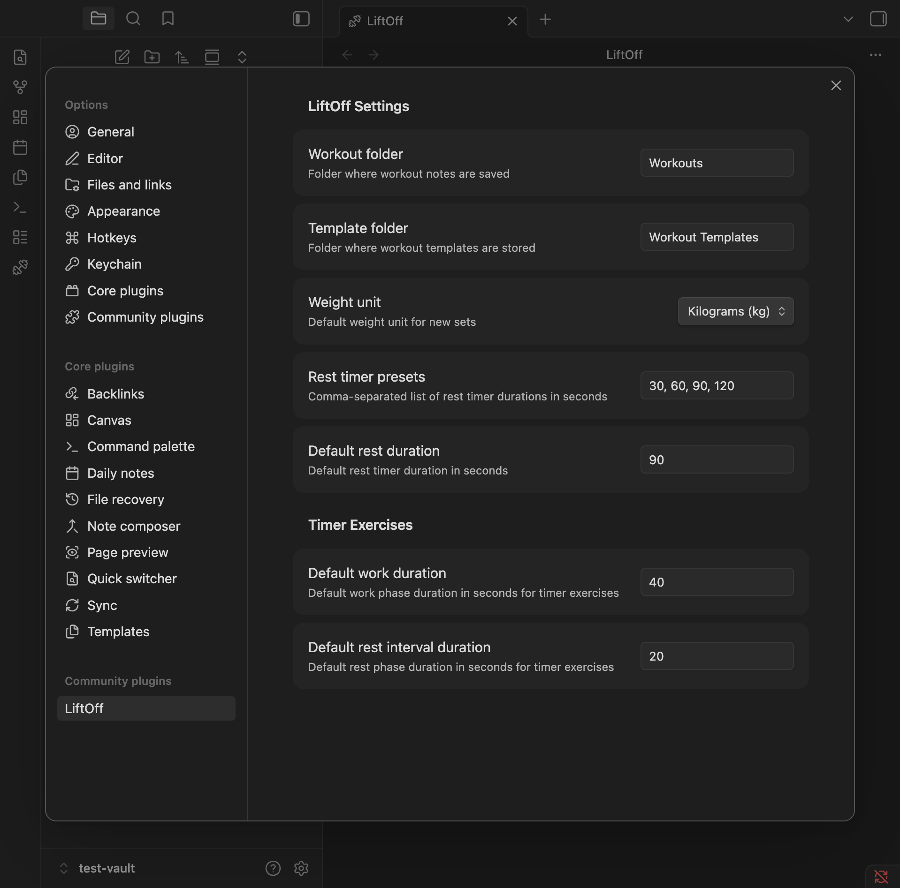

# LiftOff

Mobile-first gym workout tracker for [Obsidian](https://obsidian.md). Log sets, reps, and weights with speed-optimized UX. All data stored as markdown in your vault.

  
  

## Features

- Start workouts from templates or build your own
- Log sets with weight, reps, and RPE tracking
- Built-in rest timer with auto-start
- Exercise library with search
- Workout history stored as plain markdown files
- Works great on mobile

### Home

Browse templates, manage your exercise library, and see recent workouts at a glance.

### Workout Tracking

Log sets with weight and reps. Previous session data is pre-filled so you can pick up where you left off.

### Timers

Built-in rest timer with preset durations, and interval timer for timed exercises like planks.

  
  

### Settings

Configure workout and template folders, default weight unit, and rest timer presets.

## Installation

### From Community Plugins

1. Open Settings > Community Plugins
2. Search for "LiftOff"
3. Click Install, then Enable

### Manual

1. Download `main.js`, `manifest.json`, and `styles.css` from the [latest release](https://github.com/hpasic/obsidian-liftoff/releases/latest)
2. Create a folder `your-vault/.obsidian/plugins/liftoff/`
3. Copy the downloaded files into that folder
4. Enable the plugin in Settings > Community Plugins
