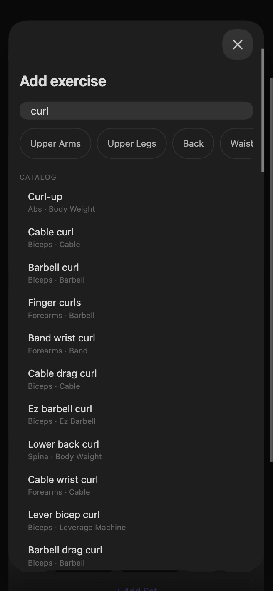

# LiftOff

Mobile-first gym workout tracker for [Obsidian](https://obsidian.md). Log sets, reps, and weights with speed-optimized UX. All data stored as markdown in your vault.

  
  

## Features

- Start workouts from templates or build your own
- Log sets with weight and reps, pre-filled from your last session
- Tag sets as warmup, working, drop, or failure — just tap the set number to cycle
- Automatic personal-record detection with a 🏆 badge the moment you beat a best
- Post-workout summary appended to every note: duration, working sets, total volume, and PRs
- Duration exercises — a count-up stopwatch for planks, dead hangs, and L-sits, with a get-set buffer and optional added weight
- Built-in rest timer with auto-start, plus an interval timer for HIIT
- Free-text notes per exercise, shown again next session
- Keeps the screen awake while a timer is running
- Exercise library with search, backed by a built-in catalog of 1,300+ exercises
- Workout history stored as plain markdown files
- Works great on mobile

### Workout tracking

Log sets with weight and reps. Previous session data is pre-filled so you can pick up where you left off. Tap the set number to cycle its type — **W**armup, working, **D**rop, or **F**ailure — and warmups and drop sets are automatically excluded from volume and PR calculations. Add a free-text note to any exercise to capture how it felt. Next session, that note appears under the exercise name, so "increase weight next time" is right where you need it. An exercise with a note is saved even if you completed no sets, and it doesn't hide your previous numbers: pre-fill still comes from the last session where you actually logged sets. An interval timer you never started is saved as not started, with its note but without its settings.

### Personal records

When a working set beats your history, LiftOff flashes a 🏆 badge on the row. It tracks three kinds of PR:

- **Heaviest weight** ever lifted for the exercise
- **Best estimated 1RM** (Epley: `weight × (1 + reps / 30)`)
- **Best single-set volume** (`weight × reps`)

Bests update mid-workout, so back-to-back PRs both light up.

### Post-workout summary

Every saved workout gets a `## Summary` section with total duration, working-set count, total volume, and the PRs you hit — a clean, readable record right in the note.

### Timers and holds

A built-in rest timer with preset durations, an interval timer for HIIT-style work/rest sets, and count-up duration holds for static exercises like planks, dead hangs, and L-sits.

Starting a hold first counts down a short get-set buffer (5 seconds by default) so you can get into position. The same buffer is subtracted when you stop, covering the time it takes to get back to your phone, so the saved time is the hold itself. Stopping before the hold outlasts the buffer records nothing. Enter an added weight on a hold for loaded carries and weighted planks; leave it empty for bodyweight. A weight carried over from last time keeps its original unit, even if you've since switched the default unit.

While any timer or hold is running, LiftOff keeps the screen from turning off. The rest timer keeps it on for up to 10 minutes of rest.

  
  

  

### Exercise catalog

Adding an exercise searches your own library and a built-in catalog of 1,300+ exercises at once. Search by name, muscle, or equipment — shorthand like `db curl` works — or tap a body-part chip to browse. Each result shows its target muscle and equipment, and anything missing is one tap away with **+ Create**. The catalog is bundled with the plugin, so it works offline.

  

### Settings

Configure workout and template folders, default weight unit, rest timer presets, the hold buffer (0 to 60 seconds; 0 turns it off), and whether to keep the screen awake while timers run.

## Installation

### From Community Plugins

1. Open Settings > Community Plugins
2. Search for "LiftOff"
3. Click Install, then Enable

### Manual

1. Download `main.js`, `manifest.json`, and `styles.css` from the [latest release](https://github.com/hpasic/obsidian-liftoff/releases/latest)
2. Create a folder `your-vault/.obsidian/plugins/liftoff/`
3. Copy the downloaded files into that folder
4. Enable the plugin in Settings > Community Plugins

## Credits

The built-in exercise catalog is generated from the MIT-licensed [exercises-dataset](https://github.com/hasaneyldrm/exercises-dataset) by Hasan Emir Yıldırım — text fields only, no media. See [`src/data/EXERCISE-DATASET-LICENSE.md`](src/data/EXERCISE-DATASET-LICENSE.md).
