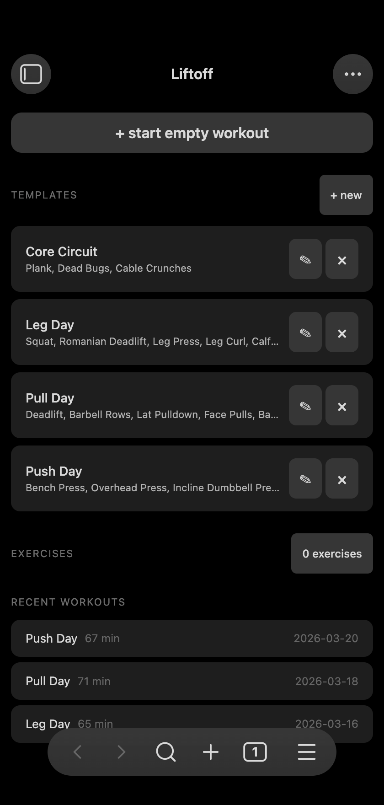
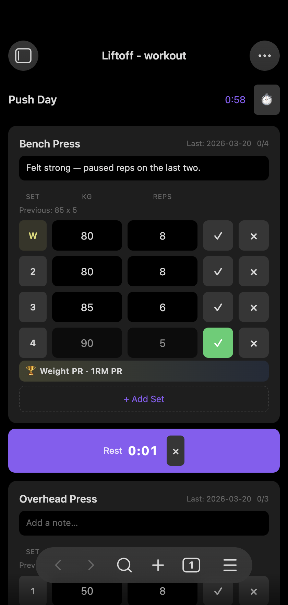
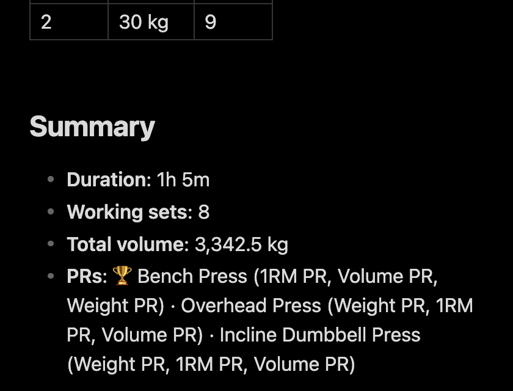
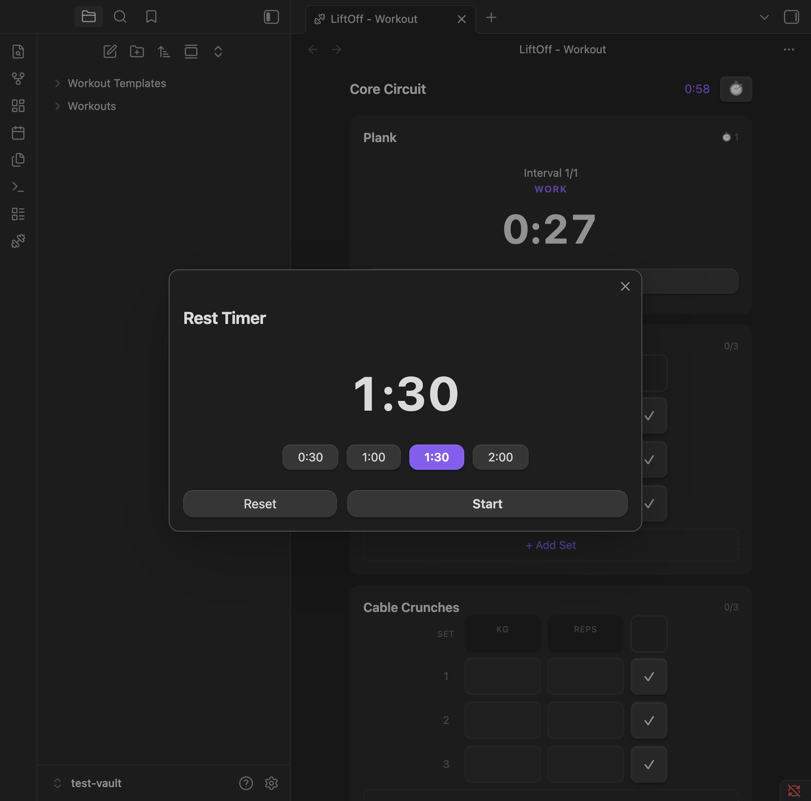
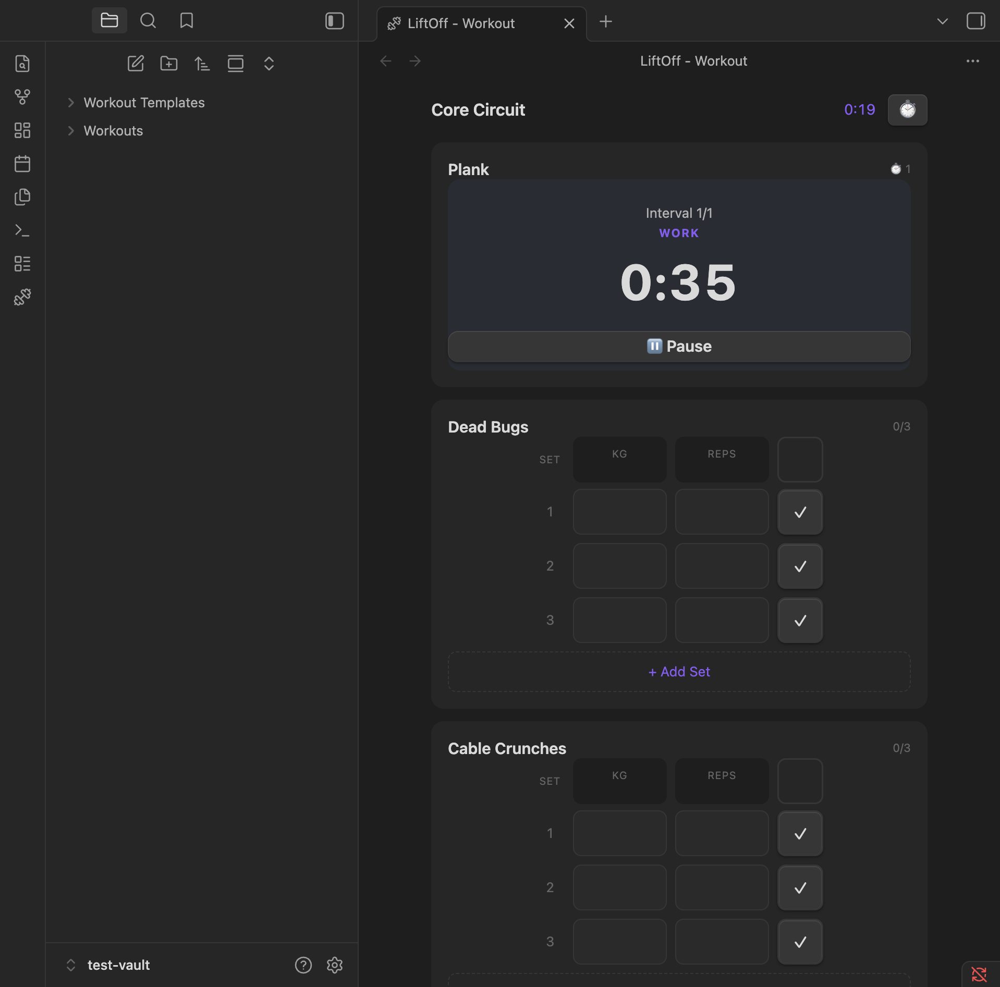
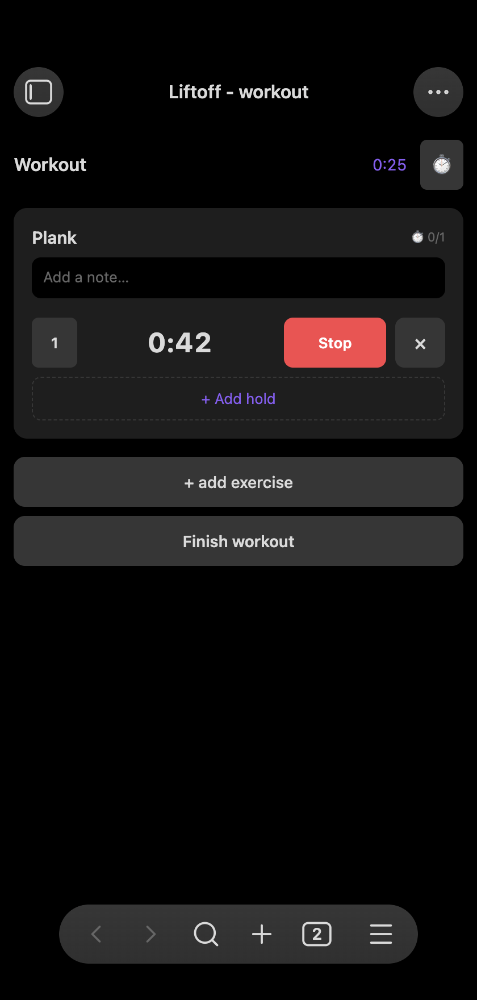
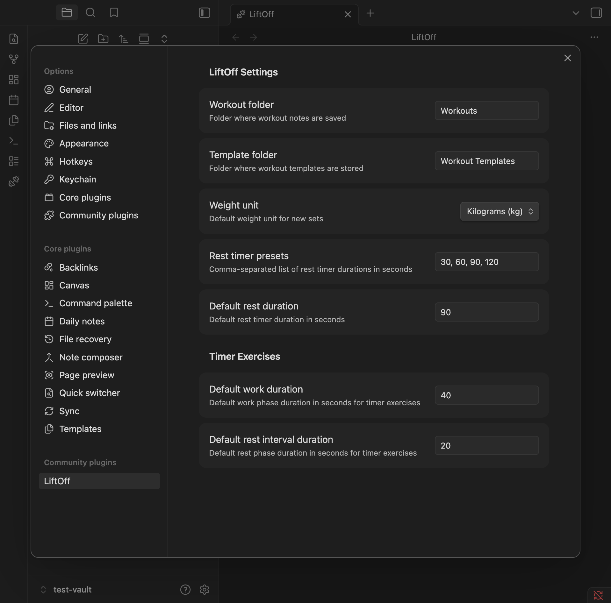

# LiftOff

Mobile-first gym workout tracker for [Obsidian](https://obsidian.md). Log sets, reps, and weights with speed-optimized UX. All data stored as markdown in your vault.

  
  

## Features

- Start workouts from templates or build your own
- Log sets with weight and reps, pre-filled from your last session
- Tag sets as warmup, working, drop, or failure — just tap the set number to cycle
- Automatic personal-record detection with a 🏆 badge the moment you beat a best
- Post-workout summary appended to every note: duration, working sets, total volume, and PRs
- Duration exercises — a count-up stopwatch for planks, dead hangs, and L-sits
- Built-in rest timer with auto-start, plus an interval timer for HIIT
- Free-text notes per exercise
- Exercise library with search
- Workout history stored as plain markdown files
- Works great on mobile

### Workout tracking

Log sets with weight and reps. Previous session data is pre-filled so you can pick up where you left off. Tap the set number to cycle its type — **W**armup, working, **D**rop, or **F**ailure — and warmups and drop sets are automatically excluded from volume and PR calculations. Add a free-text note to any exercise to capture how it felt.

### Personal records

When a working set beats your history, LiftOff flashes a 🏆 badge on the row. It tracks three kinds of PR:

- **Heaviest weight** ever lifted for the exercise
- **Best estimated 1RM** (Epley: `weight × (1 + reps / 30)`)
- **Best single-set volume** (`weight × reps`)

Bests update mid-workout, so back-to-back PRs both light up.

### Post-workout summary

Every saved workout gets a `## Summary` section with total duration, working-set count, total volume, and the PRs you hit — a clean, readable record right in the note.

### Timers and holds

A built-in rest timer with preset durations, an interval timer for HIIT-style work/rest sets, and count-up duration holds for static exercises like planks, dead hangs, and L-sits.

  
  

  

### Settings

Configure workout and template folders, default weight unit, and rest timer presets.

## Installation

### From Community Plugins

1. Open Settings > Community Plugins
2. Search for "LiftOff"
3. Click Install, then Enable

### Manual

1. Download `main.js`, `manifest.json`, and `styles.css` from the [latest release](https://github.com/hpasic/obsidian-liftoff/releases/latest)
2. Create a folder `your-vault/.obsidian/plugins/liftoff/`
3. Copy the downloaded files into that folder
4. Enable the plugin in Settings > Community Plugins
